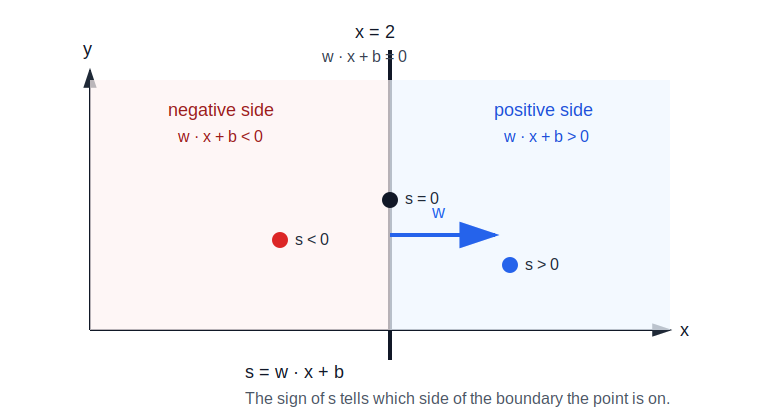
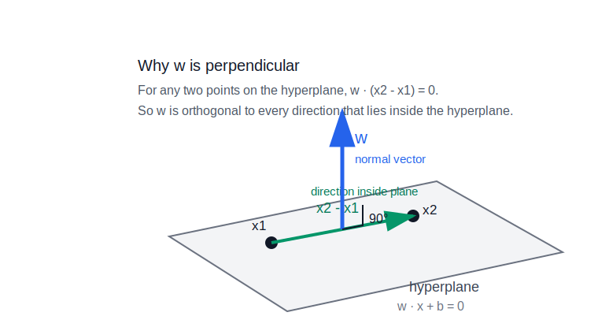
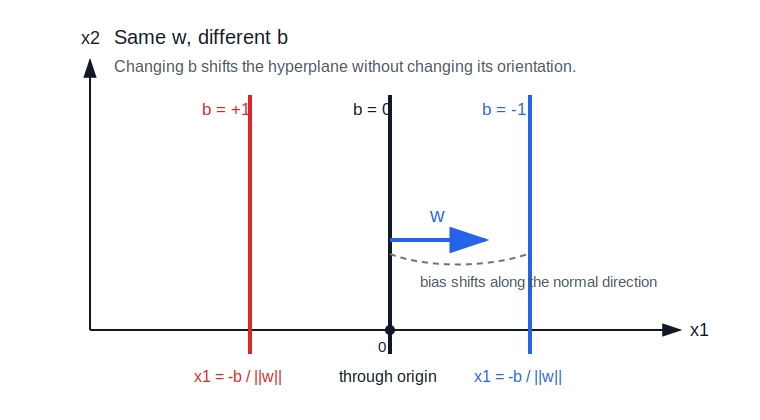

# Hyperplanes

A hyperplane is a flat boundary that is one dimension lower than the space it lives in.

Examples:

- in `R^2`, a hyperplane is a line
- in `R^3`, a hyperplane is a plane
- in `R^n`, a hyperplane has dimension `n - 1`

In neural network geometry, hyperplanes matter because a single affine neuron defines one.

## Formula

The standard formula for a hyperplane is:

```text
w · x + b = 0
```

where:

- `x` is a point or input vector in the space
- `w` is a nonzero weight vector
- `b` is a scalar bias

All points `x` satisfying the equation lie on the hyperplane.

The expression:

```text
w · x + b
```

is a signed score. Its sign tells which side of the hyperplane `x` is on.

## Signed Score



For any input point `x`, define:

```text
s = w · x + b
```

The value `s` is a scalar score. It is signed because it can be positive, zero, or negative:

```text
w · x + b > 0   -> x is on one side of the hyperplane
w · x + b = 0   -> x is exactly on the hyperplane
w · x + b < 0   -> x is on the other side of the hyperplane
```

This works because the hyperplane is exactly the set of points where the expression equals zero. Moving in the direction of `w` increases the score. Moving opposite `w` decreases the score.

For example, in two dimensions:

```text
w = [1, 0]
b = -2
```

The hyperplane is:

```text
[1, 0] · [x, y] - 2 = 0
x - 2 = 0
x = 2
```

So the hyperplane is the vertical line `x = 2`.

Testing points:

```text
point [3, 0]: 3 - 2 = 1 > 0
point [2, 5]: 2 - 2 = 0
point [1, 0]: 1 - 2 = -1 < 0
```

So:

```text
[3, 0] is on one side
[2, 5] is on the line
[1, 0] is on the other side
```

The sign gives the side. The magnitude gives how far along the `w` direction the point is from the boundary, up to scaling by `||w||`.

## Why the Weight Vector Is Perpendicular



Take two points `x1` and `x2` on the same hyperplane.

Because both points are on the hyperplane:

```text
w · x1 + b = 0
w · x2 + b = 0
```

Subtract the second equation from the first:

```text
(w · x1 + b) - (w · x2 + b) = 0
```

The bias cancels:

```text
w · x1 - w · x2 = 0
```

Factor out `w`:

```text
w · (x1 - x2) = 0
```

The vector:

```text
x1 - x2
```

is a direction that lies inside the hyperplane, because it points from one point on the hyperplane to another.

Since:

```text
w · (x1 - x2) = 0
```

the weight vector `w` is orthogonal to every direction inside the hyperplane. Therefore, `w` is perpendicular to the hyperplane.

## Role of the Bias



The bias `b` shifts the hyperplane.

If:

```text
b = 0
```

then the hyperplane passes through the origin:

```text
w · x = 0
```

If:

```text
b != 0
```

then the hyperplane is shifted away from the origin.

The weight vector `w` still determines the hyperplane's orientation. The bias determines its offset.

## Connection to Affine Neurons

A single affine neuron computes:

```text
z = w · x + b
```

The neuron's decision boundary or threshold is the hyperplane:

```text
w · x + b = 0
```

The output `z` is a [[#Signed Score|signed score]] saying which side of the hyperplane the input is on and how strongly it points in the direction of `w`.

Multiple affine neurons define multiple hyperplanes, one per neuron. See [[single-neurons-and-layers]].

## Related

- [[single-neurons-and-layers]]
- [[affine-transformations]]
- [[vector-spaces]]
- [[index]]

## Sources

- [[../../raw/personal-notes/linear-transformations-seed|Linear Transformations Seed]]
