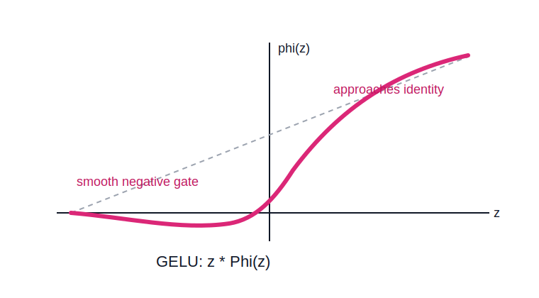

# GELU Activation

GELU, or Gaussian error linear unit, is a smooth nonlinear activation that gates an input by a Gaussian cumulative distribution term.

```text
phi(z) = z * Phi(z)
```

where `Phi(z)` is the standard normal cumulative distribution function.



## Effect

GELU behaves like a smooth, probabilistic version of [[relu-activation|ReLU]]:

- negative values are mostly suppressed, but not abruptly clipped
- small negative outputs are possible
- positive values increasingly pass through like the identity

## Geometry

GELU softly bends the representation space instead of sharply clipping it at zero. Around the origin, the transition from suppressed to active is smooth.

This smooth gating means nearby scores near zero change gradually rather than switching abruptly from inactive to active.

## Deep Learning Implication

GELU is widely used in transformer-style networks. It gives a smooth nonlinearity with behavior similar to [[relu-activation|ReLU]] on the positive side, while avoiding ReLU's hard corner at zero.

## Related

- [[activation-functions]]
- [[relu-activation]]
- [[hyperplanes]]
- [[single-neurons-and-layers]]

## Sources

- [[../../../raw/personal-notes/linear-transformations-seed|Linear Transformations Seed]]
