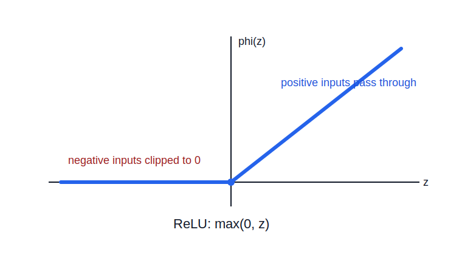

# ReLU Activation

ReLU, or rectified linear unit, is a nonlinear activation function that keeps positive values and clips negative values to zero.

```text
phi(z) = max(0, z)
```



## Effect

ReLU is [[../../linear-algebra/piecewise-linear-functions|piecewise linear]]:

- if `z <= 0`, output `0`
- if `z > 0`, output `z`

This turns a neuron's [[hyperplanes#Signed Score|signed score]] into a gate. Inputs on the inactive side of the neuron's hyperplane produce zero output. Inputs on the active side pass their score forward.

## Geometry

ReLU clips part of the representation space against coordinate axes. After a layer computes:

```text
z = Wx + b
```

ReLU applies:

```text
a = max(0, z)
```

coordinate by coordinate. Each coordinate keeps only the positive side of one neuron's hyperplane.

## Deep Learning Implication

ReLU makes networks [[../../linear-algebra/piecewise-linear-functions|piecewise linear]]. Different input regions activate different subsets of neurons, so later layers see different effective affine maps in different regions.

ReLU is simple and avoids the strong [[activation-saturation-and-gradients|saturation]] of [[sigmoid-activation|sigmoid]] and [[tanh-activation|tanh]] on the positive side, but inactive neurons can output zero over large regions.

## Related

- [[activation-functions]]
- [[activation-saturation-and-gradients]]
- [[../../linear-algebra/piecewise-linear-functions|piecewise-linear-functions]]
- [[sigmoid-activation]]
- [[tanh-activation]]
- [[hyperplanes]]
- [[single-neurons-and-layers]]

## Sources

- [[../../../raw/personal-notes/linear-transformations-seed|Linear Transformations Seed]]
