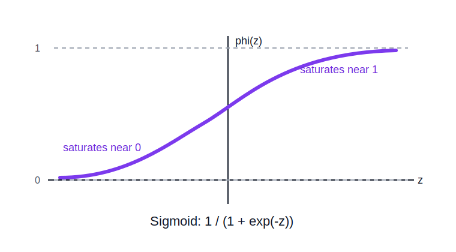

# Sigmoid Activation

The sigmoid activation smoothly maps real-valued inputs into the interval `(0, 1)`.

```text
phi(z) = 1 / (1 + exp(-z))
```



## Effect

Sigmoid turns a scalar score into a bounded value:

- large negative inputs approach `0`
- `z = 0` maps to `0.5`
- large positive inputs approach `1`

This makes sigmoid useful when an output should be interpreted as a probability-like quantity.

## Geometry

Sigmoid bends the representation smoothly and [[activation-saturation-and-gradients|saturates]] at both extremes. Very negative and very positive scores get compressed into nearly flat regions.

This means large differences in pre-activation can become small differences in activation once the function saturates.

## Deep Learning Implication

Sigmoid provides nonlinearity, but [[activation-saturation-and-gradients|saturation can weaken gradients]] in deep networks. It is now less common as a hidden-layer activation, but remains important for binary output heads and gating mechanisms.

## Related

- [[activation-functions]]
- [[activation-saturation-and-gradients]]
- [[hyperplanes]]
- [[single-neurons-and-layers]]

## Sources

- [[../../../raw/personal-notes/linear-transformations-seed|Linear Transformations Seed]]
