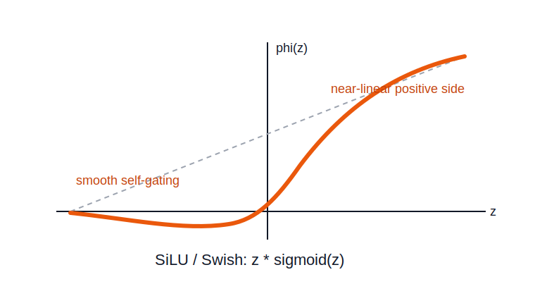

# SiLU / Swish Activation

SiLU, also called Swish, is a smooth nonlinear activation that multiplies the input by its [[sigmoid-activation|sigmoid]] gate.

```text
phi(z) = z * sigmoid(z)
```



## Effect

SiLU behaves like a smooth self-gating function:

- negative values are mostly suppressed but can remain slightly negative
- values near zero transition smoothly
- positive values increasingly pass through like the identity

## Geometry

SiLU bends the representation space smoothly. Like [[gelu-activation|GELU]], it avoids the hard corner of [[relu-activation|ReLU]] and uses a gradual gate to decide how much of the score should pass through.

The output is not monotonic over the full real line: for some negative inputs, increasing the input can initially decrease the output before the curve turns upward.

## Deep Learning Implication

SiLU is useful in modern deep networks where smooth gating works well empirically. It is closely related in shape and intuition to [[gelu-activation|GELU]], though its gate is based on the [[sigmoid-activation|sigmoid]] rather than the Gaussian CDF.

## Related

- [[activation-functions]]
- [[relu-activation]]
- [[sigmoid-activation]]
- [[gelu-activation]]
- [[hyperplanes]]
- [[single-neurons-and-layers]]

## Sources

- [[../../../raw/personal-notes/linear-transformations-seed|Linear Transformations Seed]]
