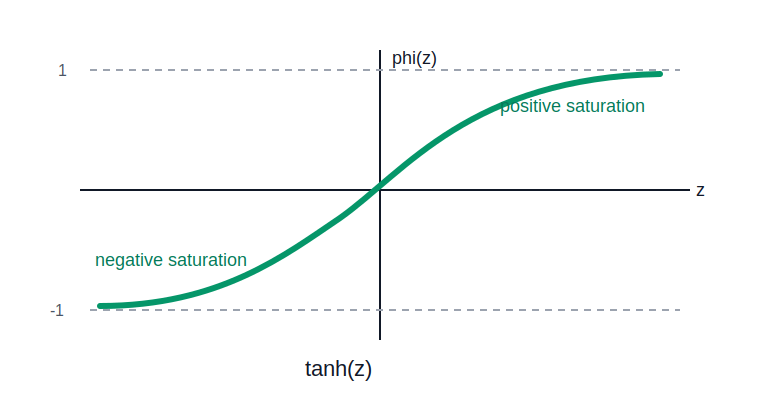

# Tanh Activation

The hyperbolic tangent activation smoothly maps real-valued inputs into the interval `(-1, 1)`.

```text
phi(z) = tanh(z)
```



## Effect

Tanh is similar to [[sigmoid-activation|sigmoid]] but **centered around zero**:

- large negative inputs approach `-1`
- `z = 0` maps to `0`
- large positive inputs approach `1`

The zero-centered output can be useful because activations can represent both negative and positive responses.

## Geometry

Tanh smoothly bends the space and [[activation-saturation-and-gradients|saturates]] at both extremes. Like [[sigmoid-activation|sigmoid]], it compresses large-magnitude scores into nearly constant output regions.

Compared with sigmoid, tanh preserves sign: negative scores remain negative, positive scores remain positive.

## Deep Learning Implication

Tanh provides nonlinearity and zero-centered activations, but its [[activation-saturation-and-gradients|saturation can still weaken gradients]] in deep networks. It is common in some recurrent architectures and older neural network designs.

## Related

- [[activation-functions]]
- [[activation-saturation-and-gradients]]
- [[sigmoid-activation]]
- [[hyperplanes]]
- [[single-neurons-and-layers]]

## Sources

- [[../../../raw/personal-notes/linear-transformations-seed|Linear Transformations Seed]]
