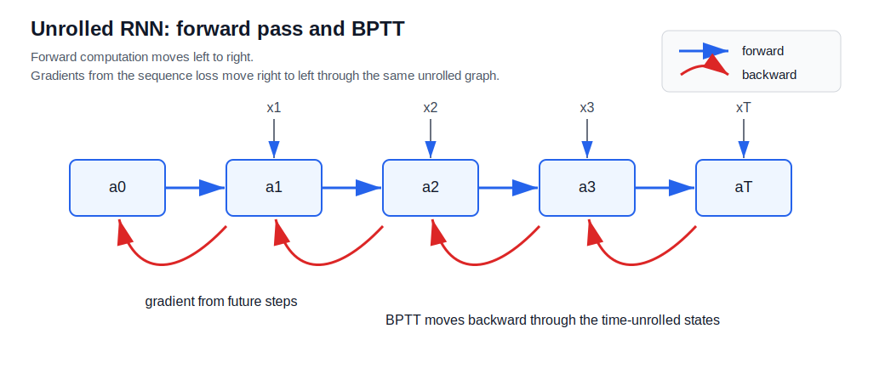
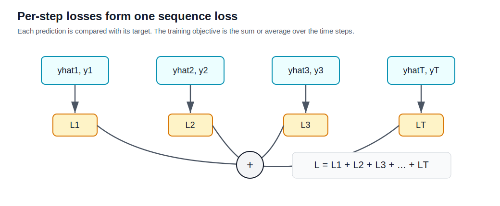
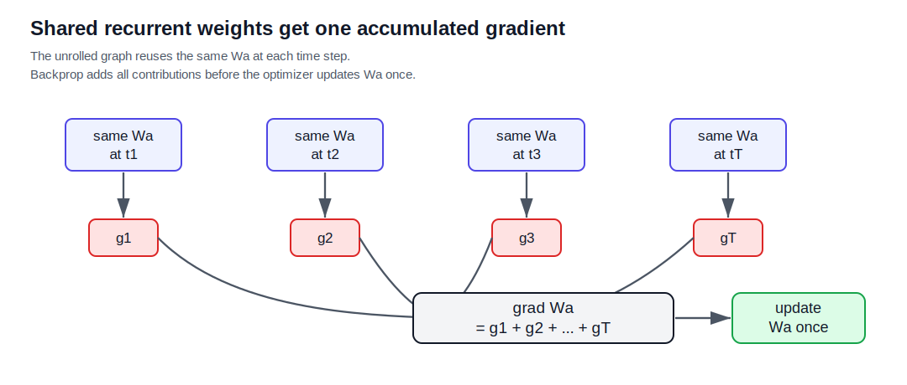

# Backpropagation Through Time

Backpropagation through time, or BPTT, is the training procedure for recurrent neural networks. It applies ordinary backpropagation to the unrolled computation graph of an [[recurrent-neural-networks|RNN]].

In forward propagation, the RNN scans left to right through the sequence:

$$
x_1 \rightarrow a_1 \rightarrow a_2 \rightarrow \cdots \rightarrow a_{T_x}
$$

During backpropagation, gradient information flows in the reverse direction through the unrolled graph:

$$
a_{T_x} \rightarrow \cdots \rightarrow a_2 \rightarrow a_1
$$

This reverse pass is why the algorithm is called backpropagation through time.

## Forward Graph

A basic RNN computes activations using shared parameters:

$$
a_t = g_a(W_a[a_{t-1}, x_t] + b_a)
$$

and predictions:

$$
\hat{y}_t = g_y(W_y a_t + b_y)
$$

The same $W_a$, $b_a$, $W_y$, and $b_y$ are reused at every time step. This means each parameter affects many activations and predictions across the sequence.

## Per-Time-Step Loss

For binary sequence labeling, each position can use the logistic cross-entropy loss:

$$
\mathcal{L}^{\langle t \rangle}(\hat{y}_t, y_t)
= -y_t \log \hat{y}_t - (1-y_t)\log(1-\hat{y}_t)
$$

This is the same objective as [[../losses/binary-cross-entropy-loss|binary-cross-entropy-loss]], applied separately at each time step.

For multi-class sequence prediction, each time step can instead use softmax [[../losses/cross-entropy-loss|cross-entropy-loss]].

## Sequence Loss

The loss for the whole sequence is commonly the sum of per-step losses:

$$
\mathcal{L}(\hat{y}, y)
= \sum_{t=1}^{T_y} \mathcal{L}^{\langle t \rangle}(\hat{y}_t, y_t)
$$

Some implementations average over time steps instead of summing. This changes the scale of gradients but not the basic computation graph.

## Shared-Parameter Gradients

Because the same parameters are used at every time step, the gradient for a shared parameter accumulates contributions from all time steps.

For example:

$$
\frac{\partial \mathcal{L}}{\partial W_a}
= \sum_{t=1}^{T_y}\frac{\partial \mathcal{L}^{\langle t \rangle}}{\partial W_a}
$$

This expression hides the recursive dependency: a loss at a later time can affect $W_a$ through many earlier activations because $a_t$ depends on $a_{t-1}$, which depends on $a_{t-2}$, and so on.

There is still only one actual parameter matrix $W_a$ in the model. The unrolled graph contains multiple uses of that same matrix, not multiple independent copies. During backpropagation, each use produces a contribution to the derivative of the total loss with respect to $W_a$, and those contributions are added into one gradient tensor.

If the sequence has three time steps, conceptually:

$$
\nabla_{W_a}\mathcal{L}
= \nabla_{W_a}\mathcal{L}^{\langle 1 \rangle}
+ \nabla_{W_a}\mathcal{L}^{\langle 2 \rangle}
+ \nabla_{W_a}\mathcal{L}^{\langle 3 \rangle}
$$

Then the optimizer applies one update to the shared matrix:

$$
W_a \leftarrow W_a - \eta \nabla_{W_a}\mathcal{L}
$$

This is the same rule used whenever a parameter is reused in a computation graph. Parameter sharing changes how many gradient paths point back to the parameter, but it does not create multiple parameter updates.

## Why Gradients Move Backward Through Time

The activation at time $t$ influences:

- the prediction $\hat{y}_t$ at the same time step
- the next activation $a_{t+1}$
- all later activations and predictions that depend on $a_{t+1}$

So the gradient with respect to $a_t$ receives information from the current loss and from future time steps. Conceptually:

$$
\frac{\partial \mathcal{L}}{\partial a_t}
= \frac{\partial \mathcal{L}^{\langle t \rangle}}{\partial a_t}
+ \frac{\partial \mathcal{L}}{\partial a_{t+1}}
\frac{\partial a_{t+1}}{\partial a_t}
$$

This recursive term is the central backward-through-time calculation.

## Practical Limitations

BPTT exposes the same limitations discussed in [[recurrent-neural-networks#Limitations|RNN limitations]]:

- long chains can produce vanishing or exploding gradients
- storing intermediate activations for many time steps can be expensive
- truncated BPTT reduces cost but limits direct credit assignment across long distances

Modern frameworks usually compute BPTT automatically with automatic differentiation, but understanding the unrolled graph explains why RNN training is sensitive to sequence length.

## Related

- [[recurrent-neural-networks]]
- [[rnn-forward-propagation]]
- [[rnn-architecture-types]]
- [[lstm-networks]]
- [[../losses/binary-cross-entropy-loss|binary-cross-entropy-loss]]
- [[../losses/cross-entropy-loss|cross-entropy-loss]]

## Sources

- [[../../../raw/courses/coursera/sequence-models/backpropagation-through-time-video-transcript|Coursera Sequence Models: Backpropagation Through Time Video Transcript]]
