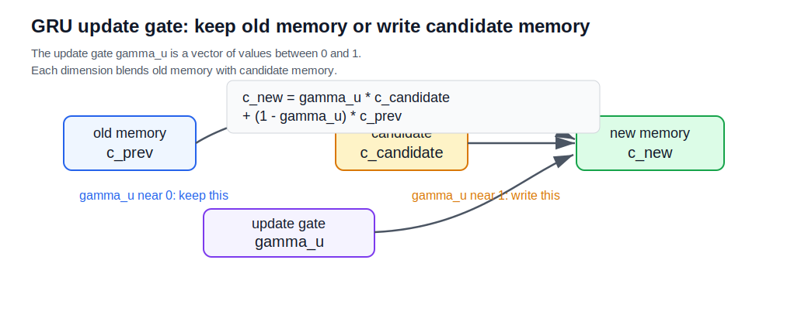
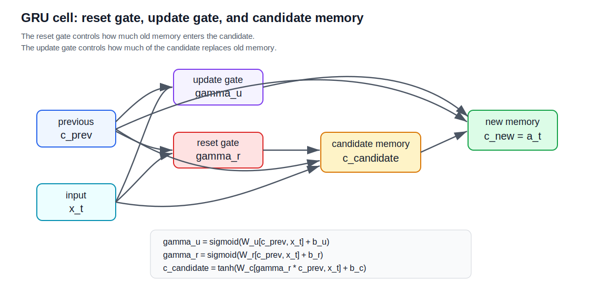

# Gated Recurrent Units

A gated recurrent unit, or GRU, is a gated [[recurrent-neural-networks|recurrent neural network]] cell designed to preserve useful information across long gaps more reliably than a basic RNN.

The core idea is to replace the simple hidden-state update with gates that decide:

- what candidate memory to propose
- which memory dimensions to update
- how much previous memory should influence the candidate

GRUs are often discussed alongside [[lstm-networks|LSTMs]] because both use gates to improve long-range sequence learning and reduce the practical impact of [[recurrent-neural-networks#Vanishing and Exploding Gradients|vanishing gradients]].

## Memory and Activation

In the notation used by the Coursera transcript, the GRU has a memory cell $c_t$ and an activation $a_t$, but for a GRU these are the same:

$$
a_t = c_t
$$

This differs from an LSTM, where the cell state $C_t$ and hidden state $h_t$ are distinct.

## Simplified GRU

The simplified GRU first computes a candidate memory:

$$
\tilde{c}_t = \tanh(W_c[c_{t-1}, x_t] + b_c)
$$

Then it computes an update gate:

$$
\Gamma_u = \sigma(W_u[c_{t-1}, x_t] + b_u)
$$

The update gate blends the candidate memory with the previous memory:

$$
c_t = \Gamma_u \odot \tilde{c}_t + (1 - \Gamma_u) \odot c_{t-1}
$$

where $\odot$ means elementwise multiplication.

## Update Gate Intuition

The update gate $\Gamma_u$ controls whether each memory dimension is rewritten or preserved.

If one component of $\Gamma_u$ is near $1$, the GRU writes the candidate value into that component:

$$
c_t \approx \tilde{c}_t
$$

If one component of $\Gamma_u$ is near $0$, the GRU keeps the old memory:

$$
c_t \approx c_{t-1}
$$

This is why GRUs can help with long-range dependencies. When the update gate remains near $0$ for a dimension, that memory component can be copied forward across many time steps with little change.

For example, one dimension could help remember whether the subject "cat" is singular so a later verb can choose "was" rather than "were."

## Full GRU With Reset Gate

The full GRU adds a reset gate $\Gamma_r$. The reset gate controls how much previous memory is used when computing the candidate memory.

The gates are:

$$
\Gamma_u = \sigma(W_u[c_{t-1}, x_t] + b_u)
$$

$$
\Gamma_r = \sigma(W_r[c_{t-1}, x_t] + b_r)
$$

The candidate memory becomes:

$$
\tilde{c}_t = \tanh(W_c[\Gamma_r \odot c_{t-1}, x_t] + b_c)
$$

The final update remains:

$$
c_t = \Gamma_u \odot \tilde{c}_t + (1 - \Gamma_u) \odot c_{t-1}
$$

and:

$$
a_t = c_t
$$

## Vector Gates

In practice, $c_t$, $\tilde{c}_t$, $\Gamma_u$, and $\Gamma_r$ are vectors.

If the hidden state has $100$ dimensions, then the update gate has $100$ components. Each component decides how much to update the matching memory dimension.

This lets the GRU preserve some features while rewriting others at the same time step.

## Comparison With LSTM

GRUs are simpler than LSTMs:

- GRUs merge memory and hidden activation: $a_t = c_t$.
- GRUs use an update gate to blend old and candidate memory.
- Full GRUs use a reset gate to control candidate-memory construction.
- LSTMs maintain separate cell and hidden states and use input, forget, and output gates.

The practical choice between GRUs and LSTMs is empirical. Both are standard gated RNN cells for sequence modeling.

## Related

- [[recurrent-neural-networks]]
- [[rnn-forward-propagation]]
- [[backpropagation-through-time]]
- [[lstm-networks]]
- [[lstm-gates-and-cell-state]]
- [[lstm-variants]]
- [[../activations/sigmoid-activation|sigmoid-activation]]
- [[../activations/tanh-activation|tanh-activation]]

## Sources

- [[../../../raw/courses/coursera/sequence-models/gated-recurrent-units-video-transcript|Coursera Sequence Models: Gated Recurrent Units Video Transcript]]
- [[../../../raw/articles/colah/understanding-lstm-networks|Understanding LSTM Networks]] by Christopher Olah, 2015.
