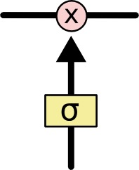
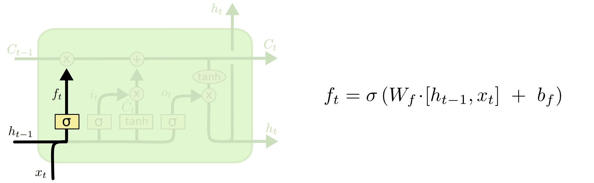
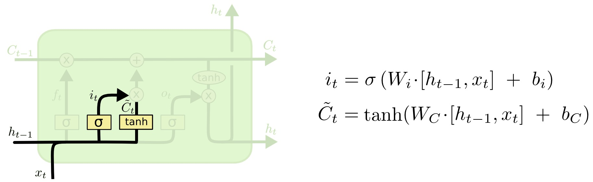
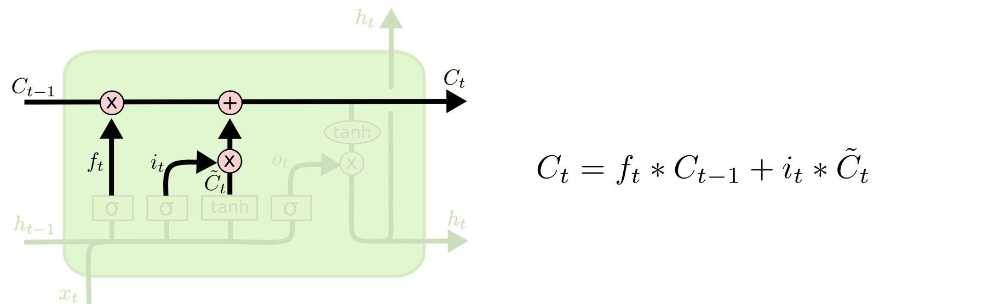
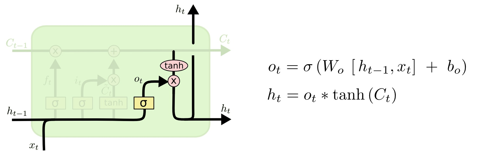

# LSTM Gates and Cell State

An [[lstm-networks|LSTM]] uses gates to regulate the cell state $C_t$. This page is the equation-level companion to the [[lstm-networks|LSTM overview]]. A gate is usually a learned affine layer followed by a [[../activations/sigmoid-activation|sigmoid activation]], producing values between $0$ and $1$ for each state dimension.

Those gate values are multiplied elementwise against vectors. Values near $0$ block information; values near $1$ pass information through.

Let $[h_{t-1}, x_t]$ mean the concatenation of the previous hidden state and current input.

## Forget Gate

The forget gate decides which parts of the previous cell state $C_{t-1}$ should remain:

$$
f_t = \sigma(W_f \cdot [h_{t-1}, x_t] + b_f)
$$

If a component of $f_t$ is near $1$, the corresponding memory component is kept. If it is near $0$, that component is erased.

## Input Gate and Candidate State

The input gate decides which components are allowed to receive new information:

$$
i_t = \sigma(W_i \cdot [h_{t-1}, x_t] + b_i)
$$

The candidate state proposes new content:

$$
\tilde{C}_t = \tanh(W_C \cdot [h_{t-1}, x_t] + b_C)
$$

The input gate scales the candidate before it is written into memory.

## Cell-State Update

The new cell state combines retained old memory and gated new memory:

$$
C_t = f_t \odot C_{t-1} + i_t \odot \tilde{C}_t
$$

This additive update is the core memory mechanism behind the [[lstm-networks#Why It Helps|long-range memory behavior]] of LSTMs. The forget gate controls retention; the input gate controls writing.

## Output Gate

The output gate decides which parts of the cell state should become the hidden state:

$$
o_t = \sigma(W_o \cdot [h_{t-1}, x_t] + b_o)
$$

$$
h_t = o_t \odot \tanh(C_t)
$$

The $\tanh(C_t)$ term bounds the cell-state values before exposure, while $o_t$ filters which components are visible in $h_t$. This is the mechanism behind the [[lstm-networks#Intuition|separation between memory and exposed hidden state]].

## Compact View

$$
\begin{aligned}
f_t &= \sigma(W_f \cdot [h_{t-1}, x_t] + b_f) \\
i_t &= \sigma(W_i \cdot [h_{t-1}, x_t] + b_i) \\
\tilde{C}_t &= \tanh(W_C \cdot [h_{t-1}, x_t] + b_C) \\
C_t &= f_t \odot C_{t-1} + i_t \odot \tilde{C}_t \\
o_t &= \sigma(W_o \cdot [h_{t-1}, x_t] + b_o) \\
h_t &= o_t \odot \tanh(C_t)
\end{aligned}
$$

## Related

- [[lstm-networks]]
- [[recurrent-neural-networks]]
- [[lstm-variants]]
- [[../activations/sigmoid-activation|sigmoid-activation]]
- [[../activations/tanh-activation|tanh-activation]]
- [[../activations/activation-saturation-and-gradients|activation-saturation-and-gradients]]

## Sources

- [[../../../raw/articles/colah/understanding-lstm-networks|Understanding LSTM Networks]] by Christopher Olah, 2015.
