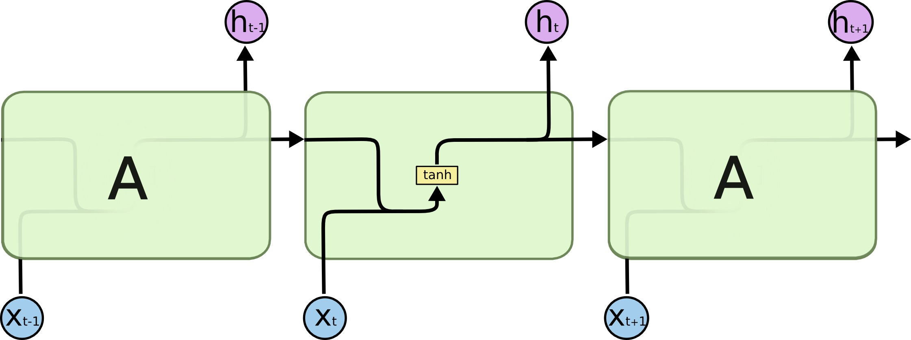
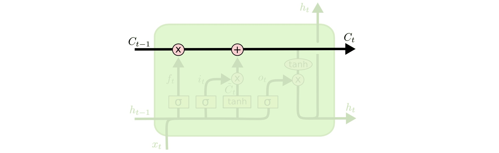
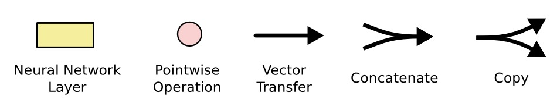

# LSTM Networks

Long short-term memory networks are a gated form of [[recurrent-neural-networks|recurrent neural network]] designed to handle long-term dependencies more reliably than simple RNNs.

The central difference is that an LSTM carries two recurrent quantities, which are updated by the mechanisms detailed in [[lstm-gates-and-cell-state|LSTM gates and cell state]]:

- $h_t$: the hidden state exposed as the step output
- $C_t$: the cell state used as a longer-lived internal memory

The cell state gives the model a path where information can move through time with relatively simple additive and multiplicative interactions. [[lstm-gates-and-cell-state|Gates]] then decide what to forget, what to write, and what to reveal.

## Repeating Module

A simple RNN often uses one repeated transformation, such as a $\tanh$ layer:

$$
h_t = \tanh(W \cdot [h_{t-1}, x_t] + b)
$$

An LSTM replaces that simple module with four interacting computations, each defined explicitly in [[lstm-gates-and-cell-state]]:

- a forget gate
- an input gate
- a candidate cell-state update
- an output gate

These computations all look at the previous hidden state $h_{t-1}$ and the current input $x_t$.

## Intuition

An LSTM separates memory management from immediate output.

The cell state $C_t$ is the memory track. It can carry information forward across many steps.

The hidden state $h_t$ is the exposed representation. It is computed from the cell state after the output gate filters which parts should be visible at the current step.

This distinction matters because the model can preserve information in the cell state even when that information is not currently useful as output.

The diagram notation uses arrows for vector flow, pointwise operations for elementwise multiplication/addition, yellow boxes for learned neural-network layers, and line merges/splits for concatenation or copying.

## Why It Helps

Simple RNNs must repeatedly transform their entire hidden state at each step. LSTMs provide a more controlled update path through the [[lstm-gates-and-cell-state#Compact View|gate equations]]:

- old memory can be kept by setting the forget gate near $1$
- old memory can be erased by setting the forget gate near $0$
- new candidate information can be written only where the input gate allows it
- the output can expose only selected parts of the cell state

This makes remembering information over long gaps a built-in behavior of the architecture rather than something the model must discover through an unconstrained recurrent transformation.

[[gated-recurrent-units|GRUs]] are a related gated RNN cell. They use fewer state variables than LSTMs by merging memory and hidden activation, while still using gates to preserve or update information.

## Related

- [[recurrent-neural-networks]]
- [[lstm-gates-and-cell-state]]
- [[gated-recurrent-units]]
- [[lstm-variants]]
- [[../activations/sigmoid-activation|sigmoid-activation]]
- [[../activations/tanh-activation|tanh-activation]]

## Sources

- [[../../../raw/articles/colah/understanding-lstm-networks|Understanding LSTM Networks]] by Christopher Olah, 2015.
