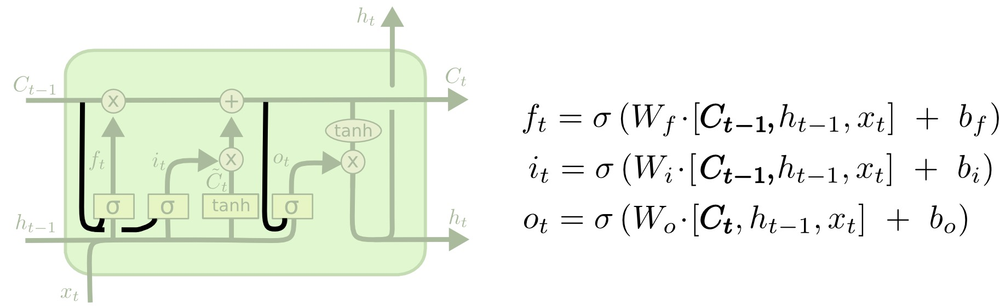
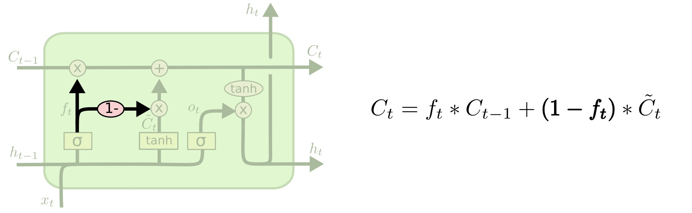
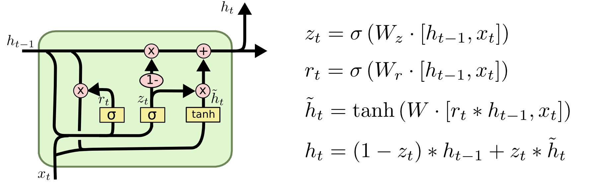

# LSTM Variants

The standard [[lstm-networks|LSTM]] is a family pattern rather than one fixed cell definition. Papers often make small architectural changes while preserving the basic idea of gated recurrent memory.

## Peephole Connections

Peephole LSTMs let gate computations inspect the cell state directly. Instead of using only $h_{t-1}$ and $x_t$, gates can also condition on $C_{t-1}$ or $C_t$.

This gives the gates direct access to memory values when deciding whether to forget, write, or output.

## Coupled Forget and Input Gates

Some LSTMs tie the forget and input decisions together. Instead of independently choosing what to erase and what to add, the cell writes new information when it forgets old information.

This reduces the degrees of freedom in the update and can make the memory replacement behavior more constrained.

## Gated Recurrent Unit

A gated recurrent unit, or GRU, is a related recurrent architecture that simplifies the LSTM structure:

- it combines the forget and input behavior into an update gate
- it merges the cell state and hidden state
- it uses fewer distinct state variables than an LSTM

GRUs are often discussed alongside LSTMs because both are gated RNNs built to improve long-range sequence learning compared with simple RNNs.

See [[gated-recurrent-units]] for the GRU update and reset gate equations.

## Open Question

The source notes that many LSTM variants have relatively small differences and cites comparative work finding similar performance across popular variants, while broader architecture searches found alternatives that could beat LSTMs on some tasks. This should be treated as historically useful but potentially stale for modern sequence modeling, where attention-based architectures now dominate many language tasks.

## Related

- [[lstm-networks]]
- [[lstm-gates-and-cell-state]]
- [[gated-recurrent-units]]
- [[recurrent-neural-networks]]

## Sources

- [[../../../raw/articles/colah/understanding-lstm-networks|Understanding LSTM Networks]] by Christopher Olah, 2015.
- [[../../../raw/courses/coursera/sequence-models/gated-recurrent-units-video-transcript|Coursera Sequence Models: Gated Recurrent Units Video Transcript]]
