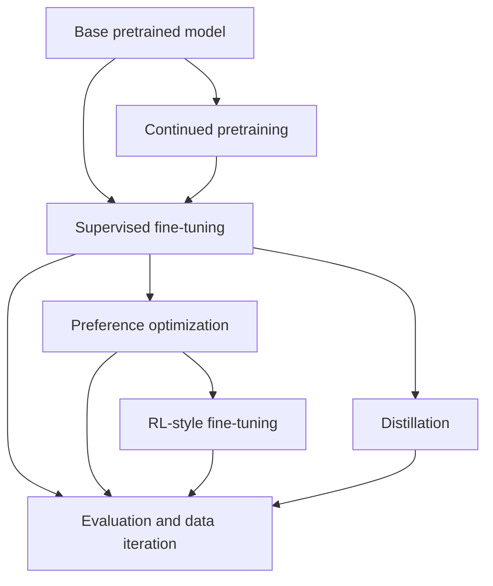

# Fine-Tuning Map for LLMs

Fine-tuning is the part of post-training where a pretrained model is updated on narrower data or objectives so it behaves better for a target task, domain, style, capability, or preference profile.

The most useful way to classify fine-tuning techniques is not by brand name, but by what signal they train on:

1. Demonstrations: "given this input, produce this good output."
2. Preferences: "given two outputs, prefer this one."
3. Rewards/verifiers: "generate outputs that score highly under a grader, reward model, or environment."
4. Compression targets: "imitate a stronger model."
5. Domain continuation: "continue language-model training on domain text."

## Big Picture

The normal learning path is:

1. Understand the base model and tokenizer.
2. Learn supervised fine-tuning.
3. Learn parameter-efficient fine-tuning.
4. Learn dataset construction and evaluation.
5. Learn preference optimization.
6. Learn RL-style post-training.
7. Learn scaling, deployment, and failure modes.

## 1. Continued Pretraining

Continued pretraining, sometimes called domain-adaptive pretraining, keeps training the model on next-token prediction using domain-specific text.

Use it when:

- The model lacks vocabulary, style, or background knowledge for a domain.
- You have a lot of raw domain text.
- You need the model to absorb distributional patterns before instruction tuning.

Examples:

- Legal corpus adaptation.
- Medical literature adaptation.
- Codebase or company-document adaptation.
- Multilingual/domain-specific language adaptation.

Risks:

- Catastrophic forgetting if the domain corpus is narrow.
- Expensive compared with adapter-based fine-tuning.
- Does not directly teach instruction-following behavior.

## 2. Supervised Fine-Tuning

Supervised fine-tuning (SFT) trains on input-output examples. For chat models, the examples are usually conversations where the target assistant response is treated as the correct completion.

Use it when:

- You know what good answers should look like.
- You want a model to follow a format, style, workflow, tool-calling pattern, or domain task.
- Prompting works sometimes, but not reliably enough.

Good SFT data is realistic, representative, and precise. OpenAI's SFT guide emphasizes starting with evals, then building a dataset of good examples, training, and comparing against a holdout set.

SFT is the best first fine-tuning technique to learn because it introduces the full practical loop: data collection, formatting, training, validation, overfitting checks, and evaluation.

## 3. Full Fine-Tuning vs Parameter-Efficient Fine-Tuning

Full fine-tuning updates all or most model weights. It is conceptually simple but expensive for LLMs, because every trained variant becomes a full copy of the model.

Parameter-efficient fine-tuning (PEFT) freezes the base model and trains a small set of additional or selected parameters.

### Main PEFT Families

Adapters:

- Add small trainable modules inside transformer layers.
- Keep the base model frozen.
- Useful when many tasks share the same base model.

LoRA:

- Freezes the base weights and injects trainable low-rank matrices into selected layers.
- Reduces trainable parameter count and memory usage.
- Common default for open-source LLM fine-tuning.

QLoRA:

- Quantizes the frozen base model, commonly to 4-bit precision, while training LoRA adapters.
- Makes large-model fine-tuning possible on much smaller hardware.
- Usually the practical starting point for individual builders fine-tuning open models.

Prompt tuning and prefix tuning:

- Learn soft prompt or prefix vectors rather than modifying most model internals.
- Historically important and still useful in some settings, but LoRA-style methods are more common for LLM adaptation.

Practical rule:

- Learn LoRA first.
- Learn QLoRA second.
- Learn full fine-tuning only after you understand why it is often too expensive.

## 4. Preference Optimization

Preference optimization trains from comparisons rather than single correct answers. A typical example has:

- A prompt.
- A preferred response.
- A rejected response.

Direct Preference Optimization (DPO) is the most important entry point. It avoids the full RLHF loop by directly optimizing the model against preference pairs. OpenAI's DPO guide recommends a common sequence: first use SFT on preferred responses, then use DPO on preference comparisons.

Use DPO when:

- Quality is subjective.
- There is no single ground-truth answer.
- You can say which of two responses is better.
- You want to tune style, helpfulness, refusal behavior, reasoning presentation, or answer quality.

Related methods to learn after DPO:

- IPO
- KTO
- ORPO
- SimPO
- CPO
- Online DPO

Do not try to memorize every variant first. Learn the shared structure: preference data, reference model, policy model, KL/control term, and the tradeoff between improving preference fit and drifting too far from the base model.

## 5. Reward Modeling and RLHF

Classic RLHF has three stages:

1. SFT on demonstrations.
2. Train a reward model from preference labels.
3. Optimize the policy with reinforcement learning, often PPO, against the reward model while controlling drift from the reference model.

The InstructGPT paper is the canonical starting point for this pipeline. Its key lesson is that human feedback can make smaller models follow instructions better than much larger base models.

Use RLHF-style methods when:

- You have a reward model, verifier, or environment.
- You care about optimizing behavior beyond static demonstrations.
- You need iterative exploration, not just imitation.

Risks:

- Training instability.
- Reward hacking.
- Over-optimization against weak reward models.
- More complex infrastructure than SFT or DPO.

## 6. Reasoning-Oriented RL and GRPO

Reasoning-oriented post-training often uses verifiable tasks such as math, code, tool calls, or structured grading. Instead of relying only on human preferences, the model can receive signals from answer checkers, tests, or automated graders.

GRPO, associated with DeepSeek-style reasoning training, is an RL method that compares groups of sampled outputs and optimizes relative performance without needing a separate value model in the same way PPO does.

Learn this after SFT, DPO, and PPO basics. It makes more sense once you understand:

- Policy gradients.
- Reward baselines.
- KL penalties.
- Sampling multiple candidate completions.
- Verifiable reward signals.

## 7. Distillation

Distillation trains a smaller or cheaper model to imitate a stronger teacher model.

Use it when:

- A large model performs well but is too slow or expensive.
- You want a smaller model to imitate a style, format, or domain behavior.
- You can generate high-quality synthetic training examples from a teacher.

Common pattern:

1. Use a strong teacher to generate demonstrations or explanations.
2. Filter and evaluate the generated data.
3. SFT a smaller model.
4. Optionally use preference optimization or RL on top.

Distillation overlaps heavily with synthetic data generation.

## 8. Data Is The Main Lever

For most practical fine-tuning work, data quality matters more than the specific optimizer.

Important data categories:

- Demonstration data: prompts and ideal responses.
- Preference data: prompt, chosen response, rejected response.
- Verifier data: problem, model output, score or pass/fail.
- Domain text: raw text for continued pretraining.
- Synthetic data: generated by stronger models, then filtered.
- Hard negatives: plausible but flawed answers.
- Evals: held-out tasks used to judge whether the model improved.

Data questions to ask:

- What behavior am I trying to change?
- Can this be solved with prompting or retrieval instead?
- What are the failure examples?
- What does a good answer look like?
- Can I build a reliable eval before training?
- Will the training data teach the model the skill, or just the style?

## 9. Evaluation Comes Before Training

A fine-tune is only useful if you can tell whether it improved the system.

Build evals before training:

- Golden examples for exact or rubric-based scoring.
- Human preference comparisons.
- Automated graders for structured outputs.
- Unit tests for code or tool-use behavior.
- Regression sets for behavior that must not get worse.
- Safety and refusal checks for production-facing models.

Track:

- Base model score.
- Prompt-only baseline.
- SFT model score.
- Preference/RL model score.
- Latency, cost, and robustness.

## 10. How To Traverse The Topic

### Phase 1: Foundations

Learn:

- Pretraining vs post-training.
- Tokenization and causal language modeling.
- Chat templates and instruction data.
- Train/validation/test splits.
- Overfitting and checkpoint selection.

Milestone:

- You can explain why fine-tuning changes behavior differently from prompting or RAG.

### Phase 2: Supervised Fine-Tuning

Learn:

- JSONL/chat data formats.
- Loss on assistant tokens.
- Epochs, batch size, learning rate.
- Holdout evals.
- Failure analysis.

Milestone:

- You can train or conceptually design a small SFT run and evaluate it against a prompt-only baseline.

### Phase 3: PEFT

Learn:

- Full fine-tuning vs LoRA.
- Rank, alpha, dropout, target modules.
- Adapter merging.
- QLoRA and quantization.

Milestone:

- You can choose LoRA or QLoRA for a specific hardware budget.

### Phase 4: Preference Tuning

Learn:

- Preference pair data.
- DPO.
- Reference model vs policy model.
- KL/drift control.
- Chosen/rejected response construction.

Milestone:

- You can decide when SFT is enough and when DPO is the better next step.

### Phase 5: RL-Style Fine-Tuning

Learn:

- Reward models.
- PPO.
- GRPO.
- Verifiable rewards.
- Reward hacking.

Milestone:

- You can distinguish imitation, preference optimization, and reward optimization.

### Phase 6: Production Loop

Learn:

- Data pipelines.
- Synthetic data generation.
- Continuous evals.
- Model versioning.
- Safety review.
- Deployment tradeoffs.

Milestone:

- You can design a full fine-tuning loop for a real product task.

## Practical Classification Table

| Technique | Training signal | Main use | Typical cost | Learn when |
|---|---|---|---|---|
| Continued pretraining | Raw domain text | Domain adaptation | High | After SFT basics |
| SFT | Correct responses | Teach format/task/style | Medium | First |
| LoRA | Same as SFT/DPO/RL, fewer trainable params | Efficient adaptation | Low-medium | After SFT |
| QLoRA | LoRA with quantized base model | Fine-tune large models on smaller hardware | Low-medium | After LoRA |
| DPO | Chosen/rejected pairs | Subjective quality and preference tuning | Medium | After SFT |
| Reward modeling | Preference scores/comparisons | Build reward signal for RL | Medium-high | After DPO |
| PPO/RLHF | Reward model signal | Optimize behavior against reward | High | Advanced |
| GRPO | Group-relative rewards | Reasoning/verifiable-task optimization | High | Advanced |
| Distillation | Teacher model outputs | Compress or transfer capability | Medium | After SFT |

## Suggested Study Order For This Vault

1. [[overview]]
2. This page.
3. A dedicated page on supervised fine-tuning.
4. A dedicated page on LoRA and QLoRA.
5. A page on data formats for SFT and DPO.
6. A page on evals for fine-tuning.
7. A page on DPO and preference optimization.
8. A page on RLHF, PPO, and reward models.
9. A page on GRPO and reasoning-oriented RL.
10. A project note: "Fine-tune a small open model for one narrow task."

## Sources

- OpenAI, "Supervised fine-tuning", API docs. https://platform.openai.com/docs/guides/supervised-fine-tuning
- OpenAI, "Direct preference optimization", API docs. https://platform.openai.com/docs/guides/direct-preference-optimization
- OpenAI, "Fine-tuning API reference", method types include supervised, DPO, and reinforcement. https://platform.openai.com/docs/api-reference/fine-tuning/overview
- Hugging Face TRL documentation, trainer taxonomy for SFT, reward modeling, DPO, PPO, GRPO, and related methods. https://huggingface.co/docs/trl/index
- Hugging Face PEFT LoRA documentation. https://huggingface.co/docs/peft/developer_guides/lora
- Hu et al., "LoRA: Low-Rank Adaptation of Large Language Models", ICLR 2022. https://www.microsoft.com/en-us/research/publication/lora-low-rank-adaptation-of-large-language-models/
- Dettmers et al., "QLoRA: Efficient Finetuning of Quantized LLMs", NeurIPS 2023. https://proceedings.neurips.cc/paper_files/paper/2023/hash/1feb87871436031bdc0f2beaa62a049b-Abstract.html
- Ouyang et al., "Training language models to follow instructions with human feedback", 2022. https://huggingface.co/papers/2203.02155
- Rafailov et al., "Direct Preference Optimization: Your Language Model is Secretly a Reward Model", 2023. https://arxiv.org/abs/2305.18290
- Houlsby et al., "Parameter-Efficient Transfer Learning for NLP", 2019. https://arxiv.org/abs/1902.00751
